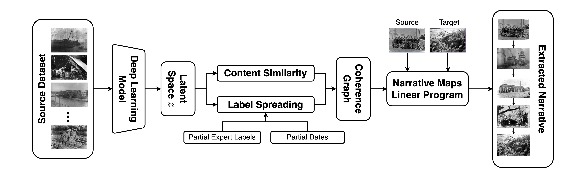

# ROGER Concept Narratives
Semi-Supervised Image-Based Narrative Extraction: A Case Study with Historical Photographic Records.

This repository contains the code for our semi-supervised method for extracting visual narratives from historical photographic records. Our approach extends the original text-based Narrative Maps algorithm to work with image data, using deep learning embeddings for visual feature extraction and similarity computation.

Key features of this project include:
- **Adaptation for Image Data**: Extension of the narrative maps algorithm to handle photographic datasets.
- **Deep Learning Integration**: Use of state-of-the-art models for feature extraction and similarity measurements.
- **Historical Dataset Application**: Applied to the ROGER dataset, featuring photographs from the 1928 Sacambaya Expedition in Bolivia by Robert Gerstmann.
- **Quantitative and Qualitative Evaluation**:
    - Comparison of algorithmically extracted visual narratives with expert-curated timelines (ranging from 5 to 30 images) using the Dynamic Time Warping (DTW) algorithm.
    - Expert qualitative evaluation of representative narrative examples.

###  Results and Contributions
Our findings demonstrate that the approach effectively generates coherent and historically accurate visual narratives, outperforming random sampling for longer timelines (10+ images, p < 0.05). This project provides a valuable tool for historians, archivists, and digital humanities scholars to analyze and interpret large-scale image collections, contributing to the computational study of visual cultural heritage.

### Acknowledgement
We thank the *Robert Gerstmann Fonds* at Universidad Católica del Norte for providing access to the photographic archive used in this work.

### Citation
This work has been accepted to the 47th European Conference on Information Retrieval (ECIR 2025). If you use our methods in your work, please include a reference to our paper. The reference details will be available soon.